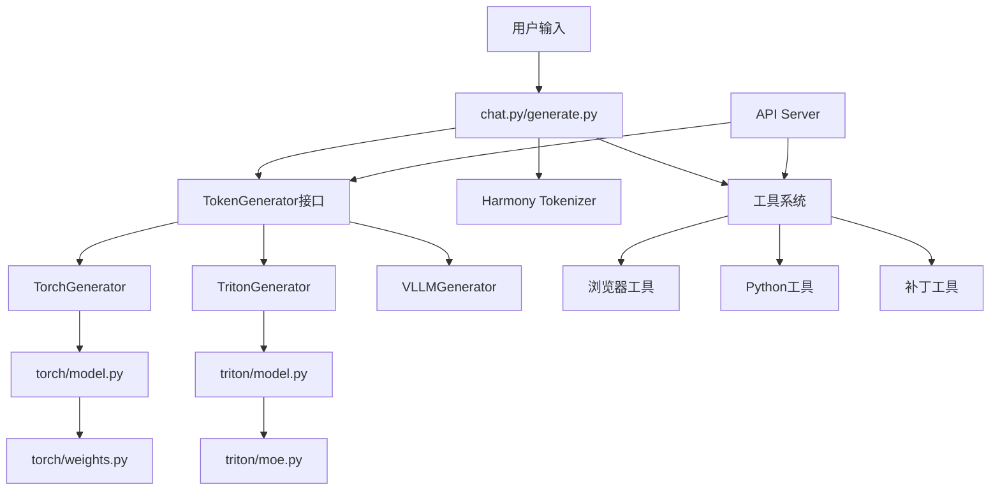

# GPT-OSS 项目技术分析总览

## 项目概述

GPT-OSS 是 OpenAI 开源的大语言模型项目，包含两个模型变体：
- **gpt-oss-120b**: 117B 参数，5.1B 活跃参数，针对生产环境优化
- **gpt-oss-20b**: 21B 参数，3.6B 活跃参数，适合低延迟和本地部署

项目采用 Apache 2.0 许可证，提供了完整的推理实现、工具系统和 API 服务。

## 核心技术栈

### 1. 模型架构
- **Transformer** 基础架构 + **MoE (Mixture of Experts)** 混合专家系统
- **MXFP4** 原生量化支持（4-bit 量化，16:1 压缩比）
- **RoPE** 位置编码 + **YaRN** 扩展
- **SwiGLU** 激活函数
- **RMSNorm** 归一化
- **GQA (Grouped Query Attention)** 分组查询注意力
- **滑动窗口注意力**机制

### 2. 推理引擎
- **PyTorch** 参考实现（教育目的）
- **Triton** 优化实现（生产级别）
- **Metal** 实现（Apple Silicon）
- **vLLM** 集成
- **Ollama** 支持

### 3. 工具生态
- **Harmony** 消息格式
- **浏览器工具**（搜索、打开、查找）
- **Python 执行工具**（Docker 容器）
- **文件补丁工具**（apply_patch）

## 项目结构

```
gpt-oss/
├── gpt_oss/              # 核心 Python 包
│   ├── torch/            # PyTorch 推理实现
│   ├── triton/           # Triton 优化实现
│   ├── metal/            # Metal GPU 实现
│   ├── tools/            # 工具系统
│   ├── responses_api/    # API 服务器
│   ├── chat.py           # 交互式聊天
│   ├── generate.py       # 文本生成
│   └── tokenizer.py      # 分词器
├── claude_doc/           # 中文技术文档
└── examples/             # 使用示例
```

## 核心模块分析

### 推理层
1. **torch/model.py** - 基础 PyTorch 模型实现 [详见文档](./01_torch_model.md)
2. **triton/model.py** - GPU 优化推理引擎 [详见文档](./02_triton_model.md)
3. **metal/source/model.c** - Apple Silicon 实现 [详见文档](./09_metal_model.md)

### 应用层
4. **chat.py** - 交互式对话系统 [详见文档](./03_chat.md)
5. **generate.py** - 文本生成接口 [详见文档](./10_generate.md)
6. **responses_api/api_server.py** - HTTP API 服务 [详见文档](./06_responses_api_server.md)

### 基础设施
7. **tokenizer.py** - Harmony 格式分词器 [详见文档](./04_tokenizer.md)
8. **torch/weights.py** - 权重加载和量化 [详见文档](./05_torch_weights.md)
9. **tools/tool.py** - 工具系统基类 [详见文档](./07_tools_tool.md)
10. **triton/moe.py** - MoE 优化实现 [详见文档](./08_triton_moe.md)

## 关键技术术语

### 名词解释
- **MoE**: 混合专家模型，通过稀疏激活降低计算成本
- **MXFP4**: 微软提出的 4-bit 浮点格式，用于模型量化
- **RoPE**: 旋转位置编码，改进的位置编码方法
- **YaRN**: Yet another RoPE extensioN，RoPE 的扩展方法
- **GQA**: 分组查询注意力，减少 KV 缓存内存占用
- **SwiGLU**: Swish-Gated Linear Unit，高效的激活函数
- **Harmony**: OpenAI 的标准化对话格式
- **Triton**: OpenAI 的 GPU 编程语言和编译器

### 主要操作
- **generate**: 生成 token 序列
- **sample**: 从概率分布采样 token
- **forward**: 模型前向传播
- **quantize/dequantize**: 量化/反量化权重
- **route**: MoE 专家路由
- **cache**: KV 状态缓存
- **stream**: 流式响应生成

## 调用关系图



## 性能特性

### 内存优化
- MXFP4 量化减少 75% 权重内存
- KV 缓存循环复用
- 分块加载避免 OOM
- CUDA 统一内存支持

### 计算优化
- Triton 自定义 CUDA 内核
- 融合操作减少内存访问
- CUDA 图优化推理延迟
- 稀疏 MoE 减少计算量

### 扩展性
- 分布式张量并行
- 多 GPU 支持
- 流式生成
- 异步工具调用

## 使用场景

1. **生产部署**: 使用 Triton 后端 + API 服务器
2. **本地开发**: 使用 Ollama 或 vLLM
3. **研究实验**: 使用 PyTorch 参考实现
4. **Apple 设备**: 使用 Metal 实现
5. **工具增强**: 集成浏览器和 Python 工具

## 项目特点

1. **完整性**: 提供从模型到 API 的完整实现
2. **模块化**: 清晰的模块划分，易于理解和扩展
3. **多后端**: 支持多种推理引擎，适应不同场景
4. **工具集成**: 原生支持工具调用，增强模型能力
5. **优化充分**: 从算法到系统的全方位优化
6. **开源友好**: Apache 2.0 许可，无专利风险

## 文档索引

1. [PyTorch 模型实现](./01_torch_model.md)
2. [Triton 优化引擎](./02_triton_model.md)
3. [交互式聊天系统](./03_chat.md)
4. [Harmony 分词器](./04_tokenizer.md)
5. [权重加载系统](./05_torch_weights.md)
6. [API 服务器](./06_responses_api_server.md)
7. [工具系统基类](./07_tools_tool.md)
8. [MoE 优化实现](./08_triton_moe.md)
9. [Metal GPU 后端](./09_metal_model.md)
10. [文本生成接口](./10_generate.md)

---

本文档集合为 GPT-OSS 项目的完整技术分析，旨在帮助理解项目架构、核心技术和实现细节，为项目重写或二次开发提供技术基础。